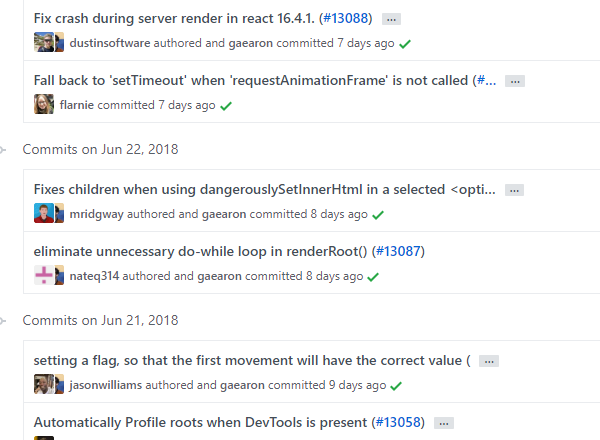
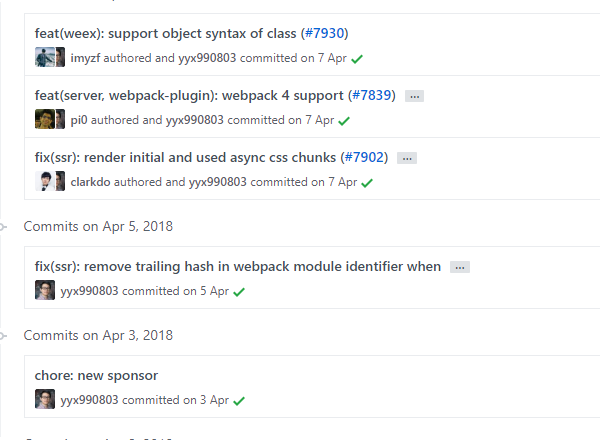
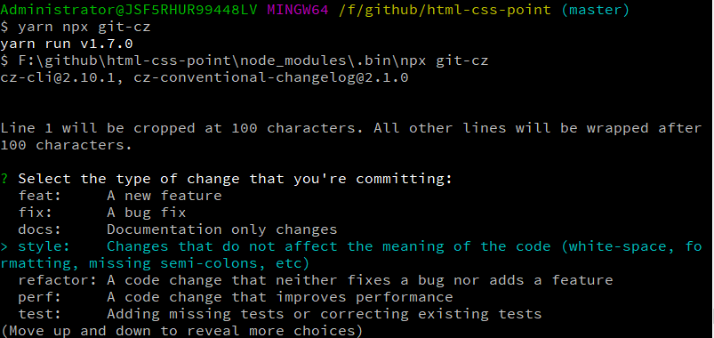
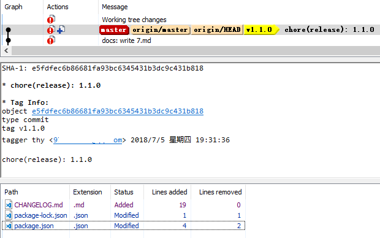

# Git Commit 规范参考
## 想法
在 github 上逛逛就可以发现，其提交的 commit 都有一定格式，工作中也有相应的规定，时间长了就能体会到其中的好处。这种约束是一种良好的实践。抽出一些时间，更详细的了解相关的资料，然后做了一些实践和总结。

## 规范 Commit 的好处
1. 提供更明确的历史信息，方便判断提交目的和浏览
2. 可以过滤某些不必要的提交，方便快速查找信息
3. 自动化生成 Change log
4. 向同事、公众与其他利益关系人传达变化的性质
5. 基于提交的类型，自动决定语义化的版本变更

以上的好处，个人认为要有一个大的前提，就是每一个提交，尽量保证其目的单一性，比如说几个 bug 看似类似，就一次性修改提交。这样做，让 commit 的信息变的复杂化，阅读不方便，也容易让人想到一些不必要的关联性。


## Commit 的格式
找了几个 start 较多的库，看看提交的格式。
1. [react-commit](https://github.com/facebook/react/commits/master)



2. [vuejs-commit](https://github.com/vuejs/vue/commits/dev)



3. [angular-commit](https://github.com/angular/angular/commits/master)


网上推荐的写法是第2和3种，也就是[ Angular 规范](https://github.com/angular/angular.js/blob/master/DEVELOPERS.md#commits)，并有配套的工具。有一个文档对 commit 的格式要求有个描述叫[约定式提交](https://conventionalcommits.org/lang/zh-Hans)。下面就根据[ Angular 规范](https://github.com/angular/angular.js/blob/master/DEVELOPERS.md#commits)和对应[文档](https://docs.google.com/document/d/1QrDFcIiPjSLDn3EL15IJygNPiHORgU1_OOAqWjiDU5Y/edit#)，看看详细的说明。

每个 commit message 包含一个 **header**，**body** 和 **footer**。**header** 有一个特殊的格式包含有 **type**，**scope** 和 **subect**：
```
<type>(<scope>): <subject>
<BLANK LINE>
<body>
<BLANK LINE>
<footer>
```
header、body、footer 之间都要空一行，**header** 是必填项，**scope** 是选填项。commit message 的每一行的文字不能超过 100 个字符。这样子在 github 和 git 工具上更便于阅读。

### Type
**type** 用于说明 commit 的类别，必须为以下类型的一种：
* **feat**: 新的功能
* **fix**: 修复 bug
* **docs**: 只是文档的更改
* **style**: 不影响代码含义的更改 (例如空格, 格式化, 少了分号)
* **refactor**: 既不是修复 bug 也不是添加新功能的代更改
* **perf**: 提高性能的代码更改
* **test**: 添加或修正测试
* **chore**: 对构建或者辅助工具的更改，例如生成文档

### Scope
**scope** 用于说明 commit 影响的范围，当影响的范围有多个时候，可以使用 `*`。

### Subject
subject 用于对 commit 变化的简洁描述：
* 使用[祈使句](https://baike.baidu.com/item/%E7%A5%88%E4%BD%BF%E5%8F%A5/19650285?fr=aladdin)，一般以动词原形开始，例如使用 change 而不是 changed 或者 changes
* 第一个字母小写
* 结尾不加句号（.）

### Body
body 用于对 commit 详细描述。使用[祈使句](https://baike.baidu.com/item/%E7%A5%88%E4%BD%BF%E5%8F%A5/19650285?fr=aladdin)，一般以动词原形开始，例如使用 change 而不是 changed 或者 changes。

body 应该包含这次变化的动机以及与之前行为的对比。

### Footer
footer 目前用于两种情况。
1. 不兼容的变动
所有不兼容的变动都必须在 footer 区域进行说明，以 `BREAKING CHANGE:` 开头，后面的是对变动的描述，变动的理由和迁移注释。
```
BREAKING CHANGE: isolate scope bindings definition has changed and
    the inject option for the directive controller injection was removed.

    To migrate the code follow the example below:

    Before:

    scope: {
      myAttr: 'attribute',
      myBind: 'bind',
      myExpression: 'expression',
      myEval: 'evaluate',
      myAccessor: 'accessor'
    }

    After:

    scope: {
      myAttr: '@',
      myBind: '@',
      myExpression: '&',
      // myEval - usually not useful, but in cases where the expression is assignable, you can use '='
      myAccessor: '=' // in directive's template change myAccessor() to myAccessor
    }

 The removed `inject` wasn't generaly useful for directives so there should be no code using it.

```
2. 关闭 issue
如果 commit 是针对某个 issue，可以在 footer 关闭这个 issue。
```
## 关闭单个
Closes #234
## 关闭多个
Closes #123, #245, #992
```
### Revert
如果 commit 用于撤销之前的 commit，这 commit 就应该以 `revert: ` 开头，后面是撤销这个 commit 的 header。在 body 里面应该写 `This reverts commit <hash>.`，其中的 hash 是被撤销 commit 的 SHA 标识符。
```
revert: feat(pencil): add 'graphiteWidth' option

This reverts commit 667ecc1654a317a13331b17617d973392f415f02.
```
### 示例
```
feat($browser): onUrlChange event (popstate/hashchange/polling)

Added new event to $browser:
- forward popstate event if available
- forward hashchange event if popstate not available
- do polling when neither popstate nor hashchange available

Breaks $browser.onHashChange, which was removed (use onUrlChange instead)
```
```
fix($compile): couple of unit tests for IE9

Older IEs serialize html uppercased, but IE9 does not...
Would be better to expect case insensitive, unfortunately jasmine does
not allow to user regexps for throw expectations.

Closes #351
```
```
style($location): add couple of missing semi colons
```
```
docs(guide): updated fixed docs from Google Docs

Couple of typos fixed:
- indentation
- batchLogbatchLog -> batchLog
- start periodic checking
- missing brace

```


## Commit 相关的工具
### 提示的工具 [commitizen](https://github.com/commitizen/cz-cli)
这个工具是用来给 commit 一个引导的作用，根据提示一步一步的完善 commit。

在window环境下安装，个人遇到的问题有：
#### 1、安装 commitizen 后，进行初始化，找不到命令


尝试成功的解决方法是用 yarn 执行指令:
```sh
yarn commitizen init cz-conventional-changelog --save-dev --save-exact
```

#### 2、按照说明里面直接执行 `npx git-cz`无效，安装了 npx 也无效

发现在 `node_modules\bin\` 目录下，并没有 `npx` 相关可执行文件,需要安装 npx。

安装后还是无效，需要用 yarn 来执行指令
```sh
yarn npx git-cz
```



可以发现执行指令后，显示了对应的可执行文件的路径。

如果配置了 scripts，那么提交的时候需要执行对应的指令，才会触发这个工具的作用。

还有操作的问题，在自己的戴尔笔记本用上下键切换无效，也尝试过各种组合键，也是无效，外接的键盘有效。
#### 提交校验工具 [commitlint](https://github.com/marionebl/commitlint)
原 [validate-commit-msg](https://github.com/conventional-changelog-archived-repos/validate-commit-msg) 已不被推荐使用。安装对应要使用的提交规范，
```sh
#it also works for Windows
yarn add @commitlint/{config-conventional,cli} --dev

# Configure commitlint to use angular config
echo "module.exports = {extends: ['@commitlint/config-conventional']}" > commitlint.config.js
```

示例用的是 `config-conventional` 规范，这个安装后，还需要使用 `commitmsg` hook，推荐使用 [husky](https://github.com/typicode/husky/tree/master)。安装husky
```sh
yarn add husky --dev
```
然后配置 package.json
```json
{
  "scripts": {
    "commitmsg": "commitlint -E GIT_PARAMS"
  }
}
```
提交时候就会触发校验，效果如下图。


#### 生成 Change log
使用的工具是 [Conventional Changelog](https://github.com/conventional-changelog)，推荐使用  [standard-version](https://github.com/conventional-changelog/standard-version)。commit 符合[Conventional Commits Specification](https://conventionalcommits.org/)中描述的格式，就可以用程序自动生成 Change log。

先进行安装。
```sh
yarn add standard-version --dev
```
然后配置package.json配置执行的脚本。
```json
{
  "scripts": {
    "release": "standard-version"
  }
}
```
执行该脚本命令，产生的结果：生成文件 CHANGELOG、自动修改库的版本号、产生一个 commit，用工具查看如下图所示。



每一次执行，不会覆盖之前的 CHANGELOG，只会在 CHANGELOG 的顶部添加新的内容。

## 感受
网上虽然有很多类似的介绍，但只有自己动手去实践了，才发现总是会有一些不一样的发现。

## 参考资料
- [Conventional Commits 1.0.0-beta.2](https://conventionalcommits.org/)
- [keep a changelog](https://keepachangelog.com/en/1.0.0/)
- [Semantic Versioning](https://semver.org/)
- [Git Commit Guidelines](https://github.com/angular/angular.js/blob/master/DEVELOPERS.md#commits)
- [Commit message 和 Change log 编写指南](http://www.ruanyifeng.com/blog/2016/01/commit_message_change_log.html)